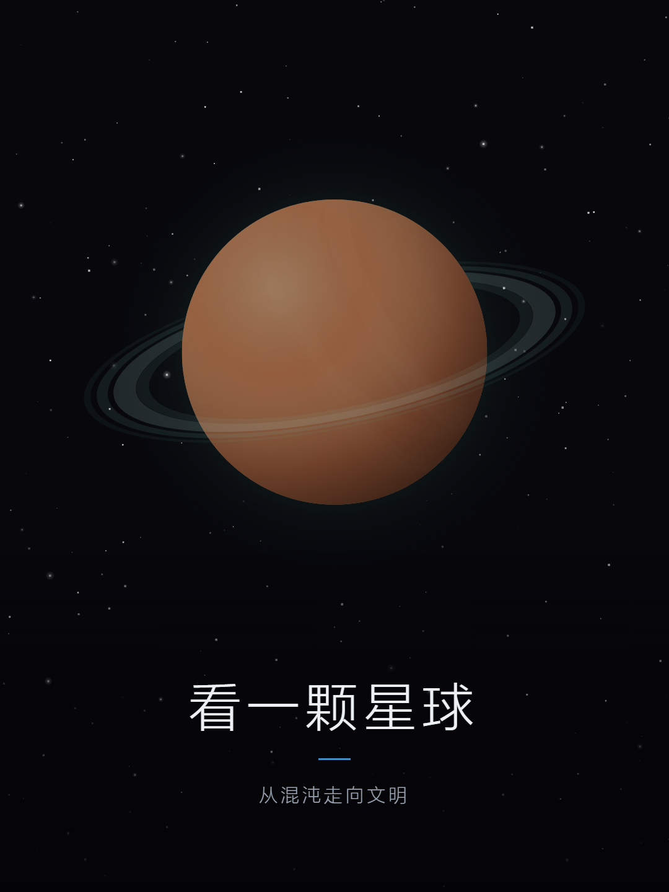

# 观测者 · Observer

看一颗星球从混沌演化到文明。

*Watch a planet evolve from chaos to civilization.*



---

一局约四分钟。星球从混沌开始，依次走过冷却、海洋、大陆、生态、文明，最后落进一份编年史和一个结局。

你要做的事很少：给世界起个名字，在两个岔路口各做一次选择，再在三次大事件里各做一次选择。剩下的交给这颗星球自己。

## 跑起来

下载这个仓库，双击 `index.html`。

没有构建步骤，没有依赖，不需要联网。

## 关于这份代码

- **零依赖**。没有框架、没有打包器、没有 npm，一共十三个代码文件。
- **完全离线**。不发出任何网络请求。
- **没有一张图片文件**。星球、星空、预兆、界面，全部由 canvas 实时绘制；仓库里唯一的图片是上面那张截图。
- **老设备也能跑**。按 Chrome 61 / Android 8.1 出厂 WebView 的能力写（ES2017），不用任何它不认识的语法。
- **逻辑和界面是分开的**。`core/` 九个文件不碰 DOM，`document` 和 `window` 一次都没出现，可以直接用 node 跑。

## 结构

```
index.html           入口
app.js               界面与主循环
style.css            样式
core/rng.js          随机数
core/elements.js     元素
core/civ.js          文明形态
core/choices.js      岔路口
core/civLore.js      历史行文案
core/civEvents.js    事件库
core/worldgen.js     星球生成
core/ending.js       结局
core/evolution.js    演化主循环
render/renderer.js   绘制
```

## 授权

MIT，见 [LICENSE](LICENSE)。
